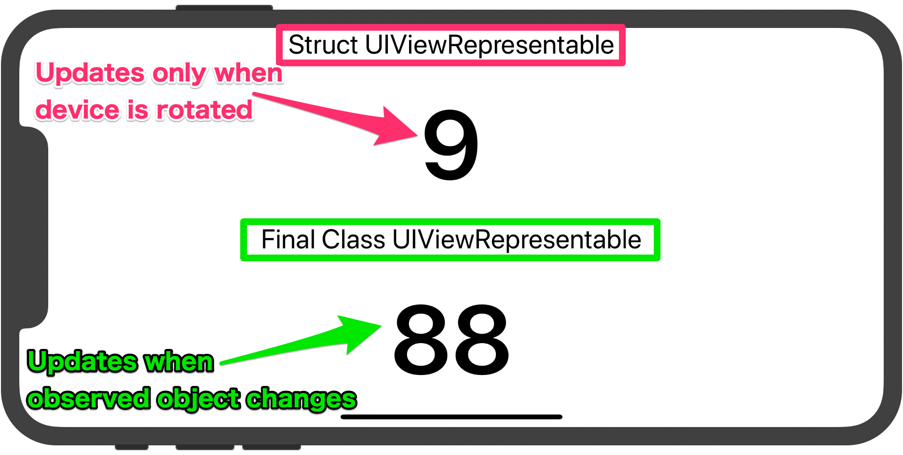

##  SwiftUI bug

As of Xcode 11.3.1 and 11.4-beta, there is a bug with updating a UIViewRepresentable. When a SwiftUI View passes an
`@ObservedObject` to a UIViewRepresentable, and the UIViewRepresentable is a `struct`, SwiftUI fails to call the
`updateUIView` method of the UIViewRepresentable when the observed object changes.

If the UIViewRepresentable is a `final class`, then its `updateUIView`  is correctly called when the observable
object changes.

### Install and run

This should be ready to go: just clone this repo and run it in Xcode 11.3.1 or 11.4-beta.

### Test structure

- A SwiftUI View with an `@ObservedObject`.
- The `@ObservedObject` changes every 1 second.
- The SwiftUI View's body contains two UIViewRepresentables:
  - one is a `struct`
  - the other one is a `final class`
- The SwiftUI View passes its `@ObservedObject` to the two UIViewRepresentables.

### Expected behavior

- Both UIViewRepresentables update every 1 second.

### Actual behavior

- The `final class` UIViewRepresentable updates correctly every 1 second.
- The `struct` UIViewRepresentable does NOT update.

Side note: the `struct` UIViewRepresentable does update when the device orientation is changed.
